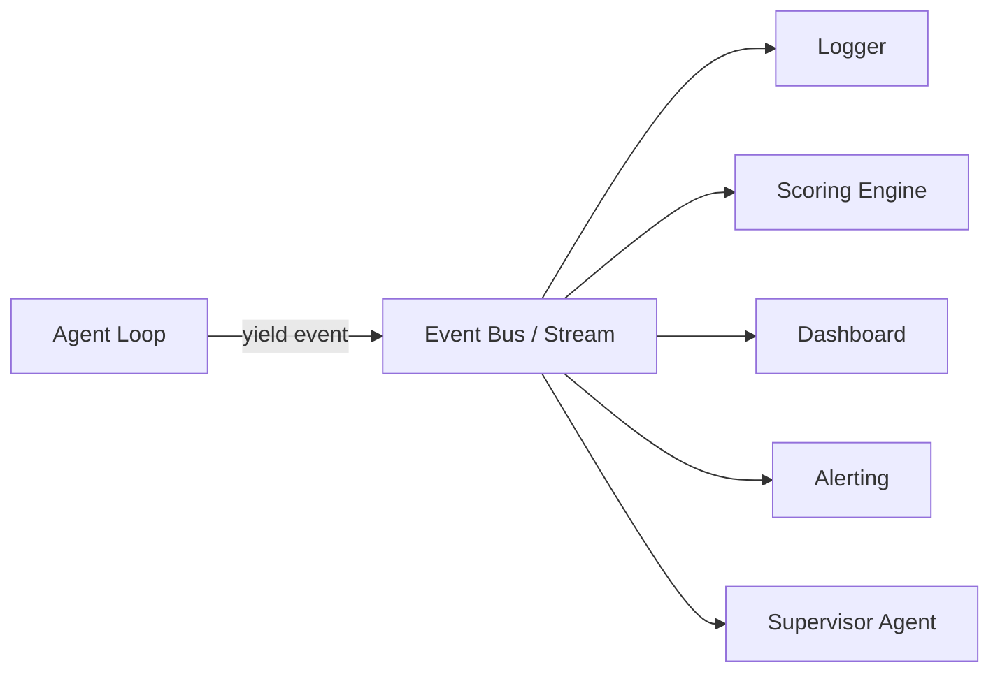
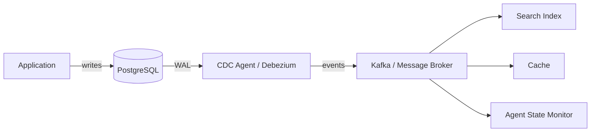
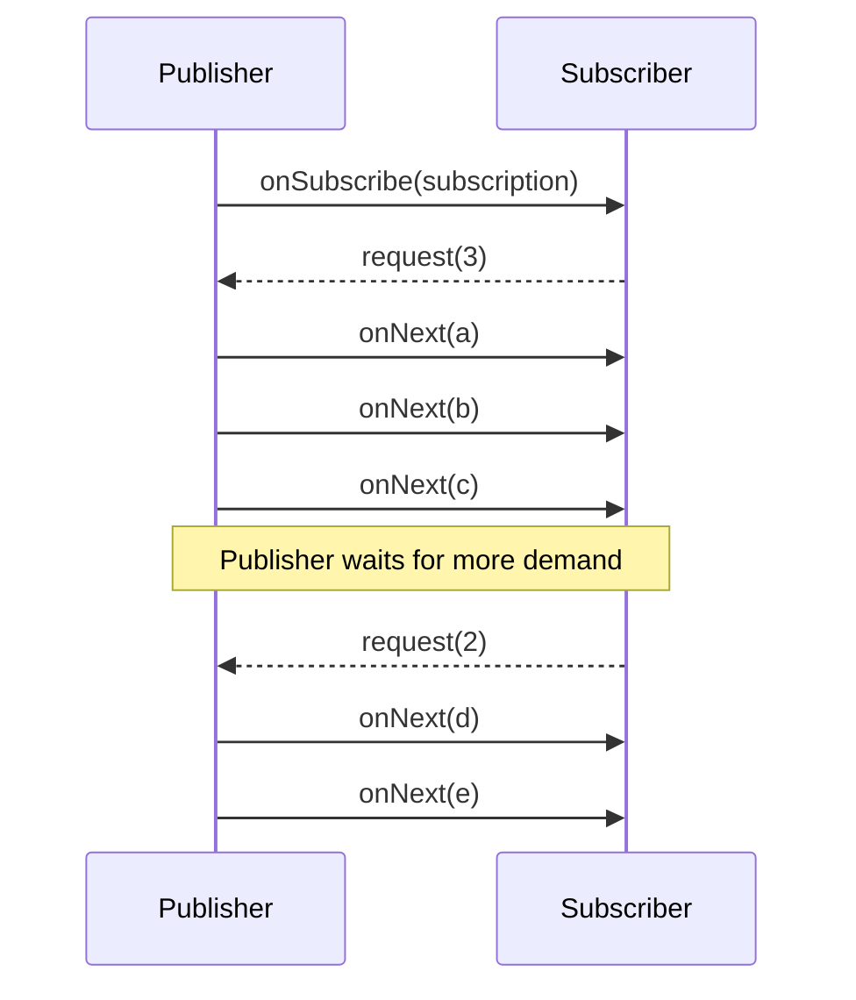
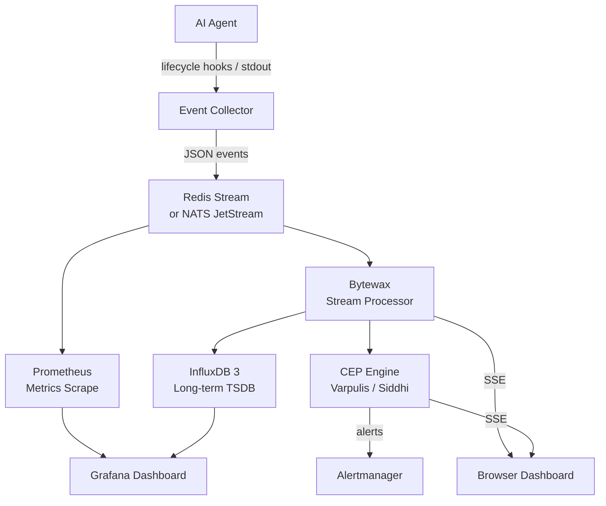
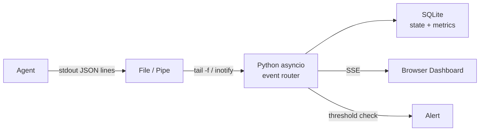

# Real-Time Event Streaming & Data Pipeline Architectures for AI Agent Monitoring

> Research compiled: 2026-09-13
> Scope: Event-driven telemetry, message queues, CDC, CEP, time-series DBs, stream processing, WebSocket/SSE, backpressure, lightweight single-PC approaches

---

## 1. Event-Driven Architectures for Agent Telemetry

### Core Pattern: Agent Events as a Stream

Every agent action emits a structured event. The event stream IS the audit trail and the real-time monitoring feed.



**Event type system (universal interface):**
```
AgentEvent =
  | RequestStart { turn_id, timestamp, agent_id }
  | TextDelta { turn_id, text, token_count }
  | ToolDispatch { turn_id, tool, args }
  | ToolResult { turn_id, tool, result, duration_ms }
  | TokenUsage { turn_id, prompt_tokens, completion_tokens, cost }
  | StepComplete { turn_id, step_index, status }
  | ErrorEvent { turn_id, error, retry_count }
  | Heartbeat { agent_id, timestamp, status }
  | Complete { turn_id, final_text, total_duration }
```

**Key architectural decisions (2025-2026 consensus):**
- **Loose coupling**: Producer (agent) and consumers (dashboard, scoring, logging) are fully decoupled through the typed event contract
- **Zero changes to add/remove consumers**: New consumer subscribes, handles events it cares about, ignores the rest
- **Event sourcing**: The event log is the source of truth; state is derived by folding over events
- **Lifecycle hooks**: Intercept agent actions (step starts, thinking updates, tool calls) and stream telemetry over WebSockets/SSE

**Industry patterns:**
- **LangGraph 1.0**: Pregel/BSP execution model where state updates ARE events. Six stream modes: values, updates, messages, tasks, checkpoints, custom
- **AutoGen v0.4 (AG2)**: Pure actor model — agents are event handlers emitting typed messages to named targets
- **Google A2A Protocol**: Uses Server-Sent Events for long-running task coordination
- **OpenTelemetry OTLP**: gRPC offers ~10x throughput of REST/JSON for equivalent payloads; standard for service-to-service telemetry export

---

## 2. Message Queues & Streaming Platforms

### Comparison Matrix

| Feature | RabbitMQ | Redis Streams | NATS + JetStream | Apache Kafka |
|---------|----------|---------------|------------------|--------------|
| **Protocol** | AMQP 0-9-1 | Redis protocol | Custom (NATS) | Custom (Kafka) |
| **Message retention** | Until consumed | Configurable | Core: none / JetStream: configurable | Configurable (log-based) |
| **Ordering** | Per-queue | Per-stream | Per-subject (JetStream) | Per-partition |
| **Consumer groups** | Yes | Yes | Yes (JetStream) | Yes |
| **Max throughput** | ~50K msg/s | ~100K msg/s | ~1M msg/s | ~1M msg/s |
| **Latency** | ~1ms | <1ms | <1ms | ~5ms |
| **Operational complexity** | Medium | Low (if Redis already running) | Low | High |
| **Replay capability** | No (queue deletes after ACK) | Yes (log-based) | Yes (JetStream) | Yes (log-based) |
| **Best for** | Task routing, DLQ, complex routing | Simple streaming when Redis already present | Microservices, request-reply, edge | High-throughput event streaming, log aggregation |
| **Single-PC fit** | Good | Excellent | Excellent | Overkill |

### Decision Framework

**For a single desktop PC (pistaisai-pi context):**

1. **Redis Streams** — Best choice if you already run Redis. Append-only log, consumer groups, `XADD`/`XREADGROUP`, `XAUTOCLAIM` for dead-consumer recovery. With `appendfsync everysec`, power loss loses ~1 second of writes (acceptable for monitoring, not payments).

2. **NATS + JetStream** — Single binary, extremely lightweight. Core NATS for fire-and-forget signals; JetStream for durable streams. Sub-millisecond latency. Docker: `nats:2.14 -m 8222`.

3. **Postgres `SELECT ... FOR UPDATE SKIP LOCKED`** — The pragmatic "no new process" option. If you already run Postgres, this is a working job queue. No broker to monitor.

4. **RabbitMQ** — When each message is a unit of work that must be acknowledged, retried bounded times, then parked in a dead-letter queue for human inspection.

5. **Kafka** — Overkill for single PC. Only if you need multi-machine clustering later.

### Key Insight: Queue vs. Log

> "A queue drops a message once it is acknowledged. A log keeps it for a retention window, so a new consumer can start at the beginning and read the whole history. Kafka and NATS JetStream are logs. RabbitMQ is a queue. That difference shapes more architectures than throughput does." — ssdnodes.com

For agent monitoring, you want a **log** (replayable event history), not a queue.

---

## 3. Change Data Capture (CDC)

### Three Methods Compared

| Method | Captures deletes? | Write impact | Latency | Setup complexity |
|--------|-------------------|--------------|---------|------------------|
| **Log-based** (WAL/binlog) | Yes | Very low (log already exists) | Seconds or less | Higher (vendor-specific formats) |
| **Trigger-based** | Yes | Higher (extra write per change) | Near real-time | Adds write overhead; schema changes |
| **Query-based** (poll `updated_at`) | **Misses deletes** | Repeated scans of source | Bounded by poll interval | Simple but lossy |

### Log-Based CDC (Production Default)

Every transactional database maintains a write-ahead log (WAL in PostgreSQL, binlog in MySQL, redo log in Oracle). CDC tools tail this log rather than querying tables.



**Event structure (Debezium format):**
```json
{
  "op": "u",
  "before": { "id": 42, "status": "running" },
  "after": { "id": 42, "status": "completed" },
  "source": { "db": "agents", "table": "sessions", "lsn": 12345678 },
  "ts_ms": 1727052800000
}
```

**For agent monitoring from log files:**
- If agent state is stored in Postgres/MySQL → Debezium streams changes with millisecond latency
- If agent writes to flat log files → `tail -f` equivalent (inotify, fsnotify) to detect file changes and emit events
- **Key advantage**: Captures deletes (batch `WHERE updated_at > X` never sees a delete — critical for "is this mandate still active?")

**Tools:** Debezium (Kafka Connect based), Flink CDC, RisingWave (native CDC without middleware)

---

## 4. Complex Event Processing (CEP)

### What CEP Does

Detects meaningful patterns across event streams — spotting fraud, triggering alerts when thresholds exceeded, identifying multi-step sequences.

> "If a user visits the pricing page, then views documentation, then abandons cart within 15 minutes" — that's a CEP pattern.

### CEP Engines Compared

| Engine | Language | Throughput | Deployment | Best for |
|--------|----------|------------|------------|----------|
| **Esper** | EPL (SQL-like) | ~300K evt/s | Embedded JVM | Mature CEP, financial patterns |
| **Siddhi** | SiddhiQL | ~1M evt/s | Standalone / K8s / embedded | IoT, multi-pattern detection |
| **Apache Flink CEP** | Java/DataStream API | ~500K evt/s | Flink cluster | Large-scale distributed CEP |
| **Varpulis** (Rust) | VPL (dedicated) | 1.5M evt/s (single core) | Single binary (15 MB) | Edge, kill-chain detection, lightweight |
| **Drools Fusion** | Rules + temporal operators | — | Embedded JVM | Business rules + event correlation |

### Pattern Example: Detect Slow Agent Steps

**The pattern:** TransactionOpen → one or more ProcessingStep where duration > 5s → within 30 minutes, partitioned by tx_id

**Varpulis (2 lines):**
```python
stream SlowTransactionStep = 
  TransactionOpen as open 
  -> all ProcessingStep where duration > 5000.0 as slow_step
  .within(30m)
  .partition_by(tx_id)
  .emit(event_type: "SlowStepAlert", tx_id: open.tx_id, 
        step_name: slow_step.step_name, duration: slow_step.duration)
```

**Esper EPL (SQL-like):**
```sql
SELECT tx_id, AVG(duration) as avg_dur, COUNT(*) as step_count
FROM ProcessingStep(duration > 5000).win:time(30 min)
GROUP BY tx_id
HAVING COUNT(*) > 3
```

**For single-PC agent monitoring:**
- **Varpulis** — Single 15MB binary, Rust, no JVM. 1.5M events/sec on one core. Built-in `.forecast()` for proactive alerting.
- **Siddhi** — Can run embedded in Java/Python apps. Good for multi-pattern detection.
- **Simple Python alternative**: `faust` (Kafka Streams in Python) or `bytewax` with windowed operations for basic pattern matching.

---

## 5. Time-Series Databases for Agent Metrics

### Comparison Matrix

| Database | Architecture | Query Language | Best For | Single-PC Fit |
|----------|-------------|----------------|----------|---------------|
| **InfluxDB 3.0** | Columnar (Apache Arrow + Parquet) | SQL + InfluxQL | Metrics, IoT, long-term retention | Good (Core is free, single binary) |
| **TimescaleDB** | PostgreSQL extension | Full SQL | Time-series + relational data together | Excellent (runs on existing Postgres) |
| **QuestDB** | Columnar (custom, SIMD) | SQL (InfluxQL line protocol) | High-throughput ingest, fast time-series JOINs | Good (single binary) |
| **Prometheus** | Custom append-only | PromQL | Kubernetes/alerting, short-term (15-30d) | Excellent (single binary, pull-based) |
| **VictoriaMetrics** | MergeTree-based | PromQL-compatible | High-cardinality, cost-sensitive | Excellent (single binary, remote-write) |
| **ClickHouse** | OLAP columnar | SQL | General analytics + time-series | Heavy for single PC |

### Recommendation for Agent Monitoring on Single PC

**Tiered approach:**
1. **Prometheus** — Scrape agent metrics every 10-30s. Alertmanager for threshold alerts. 15-day local retention.
2. **InfluxDB 3.0 Core** — Long-term storage (Parquet compression = 10-20x less disk). SQL queries for analysis. Apache 2.0, free.
3. **TimescaleDB** — If you need to JOIN metrics with relational data (agent configs, session metadata) in the same query.

**Compression reality check:** 1 trillion rows of metrics = 10TB in Postgres but ~300GB in InfluxDB/ClickHouse (30x compression).

**Downsampling strategy:**
```
10-second resolution → last 24 hours
1-minute averages   → last 7 days
1-hour averages     → last 90 days
1-day averages      → last 2 years
```

---

## 6. Stream Processing Frameworks

### Comparison

| Framework | Language | Model | Memory | Single-PC Viability |
|-----------|----------|-------|--------|---------------------|
| **Apache Flink** | Java/Scala/Python (PyFlink) | True streaming, event-time | ~3GB+ JVM | Heavy; overkill for single PC |
| **Bytewax** | Python (Rust engine) | Stateful dataflow | ~0.4 GB | **Excellent** — 25x less memory than Flink |
| **Materialize** | SQL | Continuous views (materialized) | Disaggregated state | Moderate; needs Postgres |
| **RisingWave** | SQL | Streaming database | Moderate | Good; native CDC |
| **Arroyo** | Rust | Streaming SQL | Low | Good; single binary |
| **Kafka Streams** | Java | Embedded library | JVM | Tied to Kafka |
| **ksqlDB** | SQL | Streaming SQL | JVM | Tied to Kafka |

### Bytewax: The Lightweight Champion

```python
from bytewax.dataflow import Dataflow
from bytewax import operators as op
from bytewax.testing import TestingSource

flow = Dataflow("agent_monitor")
inp = op.input("inp", flow, TestingSource(events))
evens = op.filter("keep_even", inp, lambda x: x % 2 == 0)
scaled = op.map("times_10", evens, lambda x: x * 10)
op.inspect("out", scaled)

# Run: python -m bytewax.run agent_monitor.py
# Multi-worker: python -m bytewax.run agent_monitor.py -w 2
```

**Key properties:**
- Python-native, Rust engine (Timely Dataflow)
- Event-time windows (tumbling, sliding, session)
- State recovery via SQLite partitions
- 7-25x less memory than Flink
- Deployable to Raspberry Pi
- **Caveat**: Company closed May 2025; now community-maintained

### For Single-PC Agent Monitoring

**Recommended stack:**
- **Bytewax** for stateful stream processing (windowed aggregations, pattern detection)
- **Materialize/RisingWave** if you want SQL-based continuous queries ("materialized view that updates itself")
- **Simple Python asyncio** for basic event routing if the pipeline is simple enough

---

## 7. WebSocket / SSE for Real-Time Dashboard Updates

### Decision Matrix

| Dimension | Server-Sent Events (SSE) | WebSocket |
|-----------|--------------------------|-----------|
| **Direction** | One-way (server → client) | Bidirectional |
| **Protocol** | Plain HTTP (text/event-stream) | Custom WS frames after HTTP/1.1 upgrade |
| **Browser API** | `new EventSource(url)` | `new WebSocket(url)` |
| **Auto-reconnect** | Built-in (Last-Event-ID header) | You write it yourself |
| **HTTP/2 multiplexing** | Yes (multiple streams on one connection) | No (each WS = own TCP socket) |
| **Proxy/firewall friendly** | Yes (plain HTTP) | Sometimes blocked |
| **Best for** | AI streaming, dashboards, notifications, build logs | Chat, multiplayer, collab editing, trading |
| **Time to MVP** | ~1 day | ~3-5 days + reconnect logic |

### Recommendation for Agent Dashboards

**Use SSE** for the monitoring dashboard. The dashboard only needs server→agent-status updates. The client has nothing useful to say back on the same stream.

**Node.js SSE example (40 lines):**
```javascript
app.get("/events", (req, res) => {
  res.set({
    "Content-Type": "text/event-stream",
    "Cache-Control": "no-cache",
    "Connection": "keep-alive",
    "X-Accel-Buffering": "no",
  });
  res.flushHeaders();
  const send = (data) => res.write(`data: ${JSON.stringify(data)}\n\n`);
  const interval = setInterval(() => send({ ts: Date.now() }), 1000);
  req.on("close", () => clearInterval(interval));
});
```

**Client:**
```javascript
const es = new EventSource("/events");
es.onmessage = (e) => console.log(JSON.parse(e.data));
```

**When to use WebSocket instead:**
- Operator interventions (pause agent, inject prompt correction, adjust parameters mid-run)
- Collaborative monitoring views where multiple operators see each other's annotations
- Agent-to-agent coordination channels

**Hybrid approach (production pattern):**
- SSE for telemetry stream (server → dashboard)
- Separate REST endpoint or WebSocket for control commands (dashboard → agent)

**Scaling note:** Browsers cap HTTP/1.1 connections to 6 per origin. With 6+ tabs open, SSE streams block. HTTP/2 solves this (multiplexing). For local single-PC monitoring, this is a non-issue.

---

## 8. Backpressure & Flow Control

### The Problem

> "A producer emitting 10,000 events/sec into a consumer processing 500/sec will overflow buffers within seconds."

Without backpressure: unbounded queues → OOM → crash → data loss.

### Four Primary Strategies

| Strategy | Use Case | Trade-off |
|----------|----------|-----------|
| **Buffer** (bounded) | Temporary bursts, consumer catches up | Memory pressure if buffer fills; latency |
| **Drop** | Telemetry, metrics where latest matters | Data loss (acceptable for non-critical) |
| **Latest/Coalescing** | Dashboards, sensor readings, gauges | Only most recent value survives |
| **Block/Backpressure** | Critical data that cannot be lost | Producer slows; may cascade stalls |

### Reactive Streams Protocol (Standardized)



The subscriber calls `request(n)` to declare readiness. Publisher must not emit more than requested. This is **pull-based backpressure**.

### Implementation Patterns

**Python asyncio (bounded queue):**
```python
queue = asyncio.Queue(maxsize=10)  # bounded buffer = backpressure
await queue.put(event)  # blocks when full → producer slows
```

**Kafka consumer (natural backpressure):**
```python
consumer = KafkaConsumer("agent-events", max_poll_records=50)
for message in consumer:
    process(message)  # next fetch only after processing
```

**Rust (Tokio bounded channel):**
```rust
let (tx, rx) = tokio::sync::mpsc::channel(64);  // bounded
tx.send(event).await;  // suspends when full
```

**Kotlin (Flow):**
```kotlin
val channel = Channel<Event>(capacity = 64)  // suspends send when full
```

### Layered Backpressure Strategy (Production)

1. **Bound in-flight operations**: `flatMap(fn, concurrency=64)` — cap concurrent downstream calls
2. **Bounded queues between stages**: `Queue(maxsize=N)` — absorb bursts, apply backpressure when full
3. **Credit-based flow control**: Receiver grants credits to sender; sender stops when credits exhausted
4. **Priority-based shedding**: Under 3x burst, shed low-value telemetry first; never drop compliance-critical events

### Key Principle

> "Queue is not a buffer — it is a signal. Its full() state is the single most important control point in the pipeline, because that boolean is where the system decides whether to shed, throttle, or accept." — real-time-geofencing.org

---

## Lightweight Architecture for Single Desktop PC

### Recommended Stack for pistaisai-pi



**Components and resource estimates:**

| Component | Memory | Disk | Notes |
|-----------|--------|------|-------|
| Redis Streams | ~50 MB | Minimal | Already likely running |
| Prometheus | ~200 MB | ~1 GB/month | 15d retention, 15s scrape |
| InfluxDB 3 Core | ~300 MB | ~10 GB/month | Parquet compression |
| Bytewax | ~100 MB | Minimal | SQLite state backend |
| Varpulis (CEP) | ~50 MB | Minimal | Single 15MB binary |
| Grafana | ~100 MB | Minimal | Dashboard frontend |
| **Total** | **~800 MB** | **~11 GB/month** | Fits comfortably on any desktop |

### Even Lighter: Minimal Viable Pipeline

If you want the absolute simplest thing that works:



**Single Python process, zero external dependencies beyond stdlib:**
- Agent writes JSON-line events to stdout or a file
- Python asyncio reads lines, parses, routes to:
  - SQLite for state/metrics (replaces InfluxDB)
  - SSE endpoint for dashboard (replaces Grafana)
  - Simple threshold checks for alerting (replaces Prometheus alerting)

### Technology Selection Summary

| Concern | Heavyweight (Cloud) | Lightweight (Single PC) |
|---------|---------------------|-------------------------|
| Event transport | Kafka, Kinesis | Redis Streams, NATS, Postgres |
| Stream processing | Flink, Spark Streaming | Bytewax, Python asyncio, Materialize |
| CEP | Flink CEP, IBM Streams | Varpulis, Siddhi, Esper |
| Time-series DB | InfluxDB Enterprise, Timestream | InfluxDB 3 Core, Prometheus, QuestDB |
| Real-time push | Grafana Live (WebSocket) | SSE (plain HTTP) |
| Backpressure | Reactive Streams (Akka, Reactor) | asyncio.Queue, bounded channels |
| CDC | Debezium + Kafka | RisingWave, file tailing |

---

## Sources

1. **Zylos Research** — "Real-Time Streaming Architectures for AI Agent Fleet Observability" (2026-06-10) — Protocol trade-offs for agent fleet monitoring
2. **Google Cloud** — "Power agent hubs with the Antigravity SDK" — Lifecycle hooks for telemetry and interception
3. **WFM Labs** — "Real-Time Data Streaming for WFM" — Event-driven architecture patterns for agent adherence
4. **HFT AI** — "Low-latency telemetry pipeline for event-driven AI operations" — Sub-millisecond telemetry design
5. **Zylos Research** — "Event-Driven Architecture for AI Agent Systems" (2026-03-02) — EDA vs request-response for agents
6. **AWS** — "Powering agentic AI with real-time streaming data" — Three architectural patterns for agentic AI
7. **Real Time Dispatch** — "OpenTelemetry Monitoring for AI Agents" — OTel-shaped GenAI spans in Fabric
8. **KruN** — "Real-Time AI Agent Monitoring & Runtime Control" — Event-level granularity for agent tracking
9. **Omnidatatec** — "Event-Driven Agents for Real-Time Transaction Monitoring" — Three latency tiers for streaming agents
10. **Claudepedia** — "Streaming and Events" — Typed event model for agent streaming
11. **JavaCodeGeeks** — "NATS vs. Kafka vs. Redis Streams for Java Microservices" (2026-03) — When simpler wins
12. **ScaleWithChintan** — "Evaluating Message Brokers for Scale" — Kafka vs RabbitMQ vs NATS vs Redis Streams
13. **DevTools Guide** — "Message Queue Tools Compared" — Quick comparison with code examples
14. **SSDNodes** — "NATS vs RabbitMQ vs Kafka on one VPS" — Single-server decision framework
15. **Pugazhenthi** — "Messaging Systems Explained" — Job vs event distinction
16. **arXiv:2510.04404** — "Next-Generation Event-Driven Architectures" — 12 messaging systems benchmarked
17. **Redis** — "Change Data Capture vs Batch ETL for AI Agents" — CDC for agent context sync
18. **Datus.ai** — "What Is Change Data Capture (CDC)?" — Three CDC methods compared
19. **RisingWave** — "CDC Stream Processing: The Complete Guide (2026)" — CDC backbone for real-time pipelines
20. **GeekWorkbench** — "Change Data Capture: Real-Time Database Tracking" — Debezium architecture
21. **PiStack** — "Self-Hosted Complex Event Processing: Siddhi vs Esper vs Flink CEP" — CEP engine comparison
22. **Varpulis** — "Why Are We Still Writing Callback Hell for Event Processing in 2026?" — Modern CEP DSL
23. **WiFiTalents** — "Complex Event Processing Software Ranked for 2026" — CEP platform comparison
24. **QuestDB** — "The Best Time-Series Databases in 2026" — TSDB selection guide
25. **Basekick** — "6 Best Time-Series Databases in 2026" — TSDB market fragmentation
26. **PDPSpectra** — "TimescaleDB vs InfluxDB 3.0 vs QuestDB vs IoTDB vs VictoriaMetrics" — 2026 comparison
27. **Youngju.dev** — "Time-Series Databases in 2026 Deep Dive" — Nine major TSDB candidates
28. **RepoCritics / Bytewax Wiki** — Bytewax architecture and Timely Dataflow engine
29. **LLMS3** — "From Flink to Bytewax: The Python-Native Shift" — 25x less memory than Flink
30. **Bytewax** — "Bytewax vs Flink: Efficiency, Cost, and Ease of Use" — Resource efficiency comparison
31. **Youngju.dev** — "Stream Processing 2026 Deep Dive" — Three paradigms: frameworks, SQL streaming, SaaS
32. **Ankurm.com** — "Spring Boot 4 SSE vs WebSocket STOMP" — Measured guide
33. **Khimananda** — "Server-Sent Events vs WebSockets vs Long Polling: 2026 Guide" — Protocol trade-offs
34. **Koder.ai** — "WebSockets vs SSE: Live Dashboards" — When to use which
35. **OneUptime** — "How to Use SSE vs WebSockets for Real-Time Communication" — Decision matrix
36. **AbrarQasim** — "SSE vs WebSockets in 2026" — Practical shipping advice
37. **Cadence.withremote.ai** — "How to use SSE vs WebSockets" — Decision matrix
38. **SoftwarePatternsLexicon** — "Java Backpressure Strategies in Reactive Streams" — Buffer/drop/throttle patterns
39. **TutorialQ** — "Backpressure in Reactive Programming (2026)" — Four primary strategies
40. **Hossein Nejati** — "Backpressure: Preventing Overload in Streaming Systems" — Kafka consumer backpressure
41. **HashHackers** — "Backpressure Handling: Flow Control in Reactive Systems" — RxJava/Akka strategies
42. **MartinUke0** — "Detailed Backpressure: Designing Stable, Flow-Controlled Systems" — Token/leaky bucket algorithms
43. **Real-Time Geofencing** — "Backpressure & Flow-Control Strategies" — Priority-based shedding
44. **Codelit** — "Backpressure Patterns — Flow Control for Resilient Distributed Systems" — Pull-based vs push-based
45. **Synadia** — "You Don't Need Two Platforms: The Case for Hybrid Eventing" — NATS edge architecture
46. **MartinUke0** — "Architecting Real-Time Distributed Intelligence with Persistent Actors" — Edge-native stream processing
47. **arXiv:2512.16146** — "Analysis of Design Patterns in Apache Kafka Event-Streaming Systems" — Nine recurring Kafka patterns
48. **DenverMobileAppDeveloper** — "Marterbauer" — Lightweight Rust-based stream processing alternative
